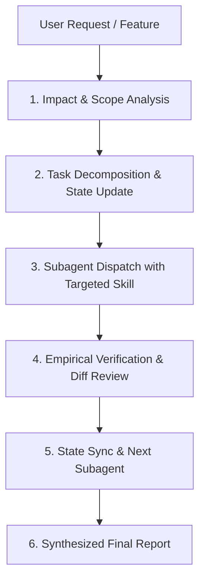

# Orchestrator & Subagent Protocol

This workspace rule governs how Antigravity operates as a primary **Orchestrator** to decompose complex developer tasks into subagent workflows with targeted skills, preventing hallucinations, dummy fallbacks, unintended side effects, and security oversights.

---

## 🏛️ Core Principles

1. **Zero Dummy Code**: Subagents must write production-ready code. Never insert dummy stubs, console logs as fallbacks, or incomplete placeholders without explicit approval.
2. **Impact & Side-Effect Pre-Check**: Before introducing a new feature or fixing a bug, perform an impact analysis across affected frontend, backend, database, and documentation layers.
3. **Empirical Verification**: Never mark a task as completed without running real build, test, or lint verification commands.
4. **Day-1 Security & Quality**: Automatically enforce security checks, DB index checks, and API test coverage on every feature delivery.

---

## 🔄 Orchestrator Execution Lifecycle

### Phase 1: Impact & Scope Analysis
- Inspect existing architecture, models, and docs (`_docs/current-status.md`, `_docs/DECISIONS.md`).
- Identify downstream impacts: breaking API changes, DB schema shifts, security exposure, or side effects on adjacent endpoints.

### Phase 2: Task Decomposition & State Tracking
- Break the task into discrete, single-domain subtasks.
- Register tasks in `_docs/current-status.md` under **Active Subagent Tasks**.

### Phase 3: Subagent Dispatch & Skill Selection
- Dispatch subagents with a dedicated context prompt.
- Pass the appropriate `.agents/skills/<skill-name>/SKILL.md` path for the subagent to read using `view_file`.

### Phase 4: Subagent Execution Contracts
Each subagent MUST operate against a strict contract:
- **`backend-architecture`**: Modular NestJS feature, Port-Adapter decoupling, global exception filters, Swagger docs.
- **`db-migration-and-seeding`**: Non-breaking schema changes, indexing optimization, TypeORM migration generation.
- **`api-testing-and-curl`**: 100% route coverage, Supertest integration tests, curl verification.
- **`bug-triage-and-root-cause`**: Log extraction, root cause analysis (RCA), regression test scaffolding.
- **`security-and-env-audit`**: Secret leak scanning, dependency vulnerabilities, OWASP checks.
- **`vps-deployment-and-monitoring`**: Docker multi-stage builds, VPS deployment scripts, health check validation.
- **`code-review-and-pr`**: Pre-flight code review, diff audit, conventional commit formatting.
- **`project-documentation`**: Syncing `_docs/`, updating `TODO.md`, `DECISIONS.md`, and `current-status.md`.

### Phase 5: Verification & Aggregation
- Orchestrator inspects subagent diffs and test results.
- If verification fails, dispatch a fix subagent with diagnostic logs.
- Synthesize all results into a clean, professional report for the user.
