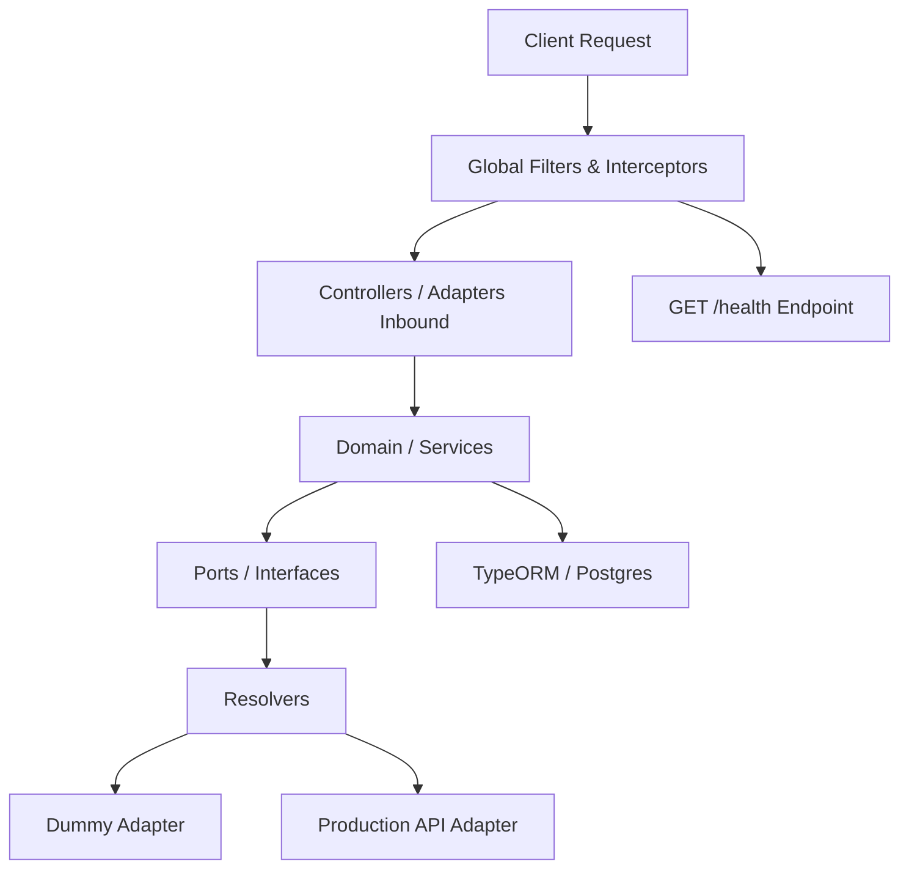

# 🏗️ NestJS Microservices Architecture & Scaffolding Guide

This skill provides a comprehensive template, architectural reference, and step-by-step scaffolding runbook for creating new backend microservices that follow the exact architecture, design patterns, and deployment configurations of production NestJS backend microservices.

---

## 🤖 Subagent Execution Contract

When assigned this skill by the Orchestrator, the subagent MUST adhere to the following contract:
- **Inputs Required**: Feature scope, module name, entity fields, API endpoints, DTO properties.
- **Strict Guidelines**: No dummy stubs, empty array fallbacks, or console logging placeholding. All business logic must be fully implemented with proper NestJS controllers, services, ports, adapters, and DTO validations.
- **Verification Command**: `npm run build` (must compile cleanly without TypeScript errors).
- **Deliverable**: Modular feature under `src/modules/<feature>` with Swagger annotations and error handling.

---

## 🌟 Core Architectural Pillars

All NestJS backend microservices are built upon five fundamental pillars:



1. **Modular Domain Design:** Features are organized into self-contained feature folders directly under `src/` (e.g., `src/translation/`, `src/users/`, `src/notifications/`). Each directory manages its own controllers, services, entities, DTOs, and interface layers.
2. **The Port-Adapter-Resolver Pattern:** External integrations (like Google GenAI, ElevenLabs, or Google Cloud Translate) are decoupled from the business domain. The service communicates via a **Port** (Interface), which is implemented by multiple **Adapters** (e.g., `GoogleTranslateAdapter`, `DummyTranslateAdapter`). A **Resolver** dynamically routes calls to the correct adapter at runtime based on environment variables.
3. **Robust Global Infrastructure:** Standardized middleware configuration across all services:
   - **Global Exception Handler:** Centralized `HttpExceptionFilter` registered globally to catch all uncaught exceptions, system failures, and HTTP errors, transforming them into a standard, structured `ErrorResponse` schema (`success: false`, `requestId`, `timestamp`, `errorCode`).
   - **Configurable Log Levels:** Dynamic logging verbosity governed by the `.env` variable (`LOG_LEVEL=debug|info|warn|error`). Configured in NestJS logger at bootstrap to control output verbosity seamlessly across environments.
   - Centralized validation pipes (`class-validator`).
   - Custom `LoggingInterceptor` to profile route response duration and attach transaction IDs (`x-request-id`).
   - Global prefixing (`api/v1`).
4. **Absolute Swagger/OpenAPI Documentation (.env-Gated):**
   - Swagger documentation must be comprehensive and absolute (100% endpoint, request, and response coverage).
   - Enabling and disabling Swagger UI is strictly controlled via `.env` (`SWAGGER_ENABLED=true`).
   - Every API request DTO property and response model must feature explicit descriptions and sample values.
   - When an endpoint supports multiple request types/variants, Swagger UI must expose a dropdown selector (`@ApiBody({ examples: { ... } })`) for switching between example requests.
5. **Mandatory Health & Diagnostics API:**
   - Every service must expose a dedicated `/health` (or `/api/v1/health`) endpoint.
   - Must return real-time operational status and metrics for all underlying infrastructure—including PostgreSQL database connectivity, Redis cache ping status, process uptime/memory usage, and key downstream vendor APIs.
6. **Comprehensive Telemetry & Prometheus Metrics:**
   - Dedicated telemetry instrumentation exposing Prometheus-formatted metrics at `/metrics` (or `/api/v1/metrics`).
   - Tracks both **Global** and **Route-Specific** telemetry:
     - **RPS (Requests Per Second):** Global RPS & route-specific RPS.
     - **Success & Failure Counts:** Global & endpoint-specific HTTP 2xx success vs 4xx/5xx failure counters.
     - **Exception Counts:** Global & route-specific unhandled exception & caught error counters.
     - **Latencies:** API HTTP request duration histograms (p50, p90, p99) and Database (TypeORM) query execution latency histograms.
     - **Process Telemetry:** Node.js event loop lag, RSS/Heap memory, active handles, process CPU usage, and uptime.
7. **Database Migrations & Non-Breaking Schema Safety:**
   - Database schema changes in production/preprod environments MUST be executed via explicit TypeORM migrations (`src/database/migrations/`).
   - `synchronize: false` is strictly enforced in production to prevent schema loss.
   - Standardized TypeORM CLI `DataSource` configuration and npm scripts (`migration:generate`, `migration:run`, `migration:revert`) ensure versioned, reproducible database schema evolutions.
8. **Declarative Prompt Engineering:** For AI-integrated services, LLM system instructions are maintained as static templates in a dedicated `prompts/` folder rather than hardcoded in TypeScript. They are read from the filesystem at startup and interpolated dynamically.
9. **Zero Dependency Vulnerabilities Compliance:**
   - All package dependencies in `package.json` must be strictly audited and maintained at **0 vulnerabilities** (`npm audit` must pass with 0 vulnerabilities).
   - Require explicit version overrides (`"overrides": { ... }`) in `package.json` for any transitive third-party vulnerabilities.
   - Running `npm install` or `npm audit` on the codebase MUST result in **`0 vulnerabilities`** at all times.
10. **Mandatory Meaningful README.md Documentation:**
    - Every backend service repository MUST include a comprehensive, meaningful `README.md` at its root directory.
    - The README.md must clearly document:
      - Project overview, purpose, and business domain scope.
      - Architecture diagram, tech stack, and module organization.
      - Environment variable setup (`.env.example` reference & required keys).
      - Database migration workflow (`npm run migration:generate`, `npm run migration:run`).
      - REST API documentation (`/api/v1/docs`), Health probes (`/api/v1/health`), and Telemetry metrics (`/api/v1/metrics`).
      - Local development quickstart and Docker container deployment instructions.

---

## 📁 Standard Directory & Scaffolding Structure

Below is the standard, production-ready directory structure for any new NestJS backend service:

```text
my-new-service/
├── .github/
│   └── workflows/
│       └── deploy.yml          # Automated CI/CD pipeline to VPS
├── src/
│   ├── common/                 # Shared cross-cutting concerns
│   │   ├── constants/
│   │   │   └── provider-tokens.ts # Token string definitions for interface injection
│   │   ├── decorators/
│   │   ├── dto/
│   │   │   └── response.dto.ts # Unified API response formats (Success/Error)
│   │   ├── filters/
│   │   │   └── http-exception.filter.ts # Global NestJS exception filter
│   │   └── interceptors/
│   │       └── logging.interceptor.ts # Global latency and Request ID logger
│   │
│   ├── config/
│   │   └── app.config.ts       # Global app config registrations
│   │
│   ├── database/
│   │   ├── migrations/         # Auto-generated & custom TypeORM schema migrations
│   │   ├── database.module.ts  # Database connection module
│   │   └── typeorm.config.ts   # Database & TypeORM DataSource CLI configuration
│   │
│   ├── health/                 # Mandatory Health & Diagnostics Module
│   │   ├── health.controller.ts # GET /health route definition with Swagger docs
│   │   ├── health.module.ts     # Health module registration
│   │   └── health.service.ts    # Service probes (PostgreSQL, Redis, External APIs)
│   │
│   ├── telemetry/              # Mandatory Telemetry & Metrics Module
│   │   ├── telemetry.controller.ts # GET /metrics endpoint for Prometheus scraping
│   │   ├── telemetry.interceptor.ts  # Route latency, RPS, success/failure metric collector
│   │   ├── telemetry.module.ts      # Telemetry module registration
│   │   ├── telemetry.service.ts     # Prometheus counters, histograms, and gauges
│   │   └── typeorm-telemetry.logger.ts # DB Query Latency instrumentor
│   │
│   ├── [feature-name]/         # Modular feature directory (e.g., translation)
│   │   ├── adapters/           # Outbound adapters (integrations)
│   │   │   ├── dummy-[feature].adapter.ts
│   │   │   └── [production-provider].adapter.ts
│   │   ├── dto/                # Data Transfer Objects for endpoints validation
│   │   │   └── [request/response].dto.ts
│   │   ├── entities/           # Database tables TypeORM models
│   │   │   └── [feature].entity.ts
│   │   ├── enums/              # Feature-specific TypeScript enums
│   │   ├── interfaces/         # Port definition interfaces
│   │   │   └── [feature]-port.interface.ts
│   │   ├── prompts/            # System instruction txt files (if LLM integration)
│   │   │   └── system-instruction.txt
│   │   ├── resolvers/          # Selection routing adapter
│   │   │   └── [feature].resolver.ts
│   │   ├── [feature].controller.ts # Rest API definitions & controllers
│   │   ├── [feature].module.ts     # Feature modules registrations
│   │   └── [feature].service.ts    # Main business domain logic
│   │
│   ├── app.module.ts           # Root module loading configs & features
│   └── main.ts                 # Bootstrap setup (validation, logs, cors, swagger)
│
├── .dockerignore
├── .env.example
├── .gitignore
├── DEPLOYMENT.md               # Guide explaining VPS setup details
├── Dockerfile                  # Multi-stage production build definition
├── docker-compose.yml          # Local database / resources runner
├── nest-cli.json
├── package.json
└── tsconfig.json
```

---

## 🛠️ Step-by-Step Scaffolding Runbook

Follow these steps to spin up a new microservice from scratch:

### Step 1: Initialize Project & Dependencies

```bash
# 1. Initialize NestJS project
npx -y @nestjs/cli@latest new my-new-service --package-manager=npm
cd my-new-service

# 2. Install production dependencies
npm install @nestjs/config @nestjs/typeorm typeorm pg @nestjs/swagger class-validator class-transformer dotenv uuid prom-client

# 3. Install developer types and dependencies
npm install --save-dev @types/uuid
```

Configure `tsconfig.json`:
```json
{
  "compilerOptions": {
    "module": "commonjs",
    "declaration": true,
    "removeComments": true,
    "emitDecoratorMetadata": true,
    "experimentalDecorators": true,
    "allowSyntheticDefaultImports": true,
    "target": "ES2021",
    "sourceMap": true,
    "outDir": "./dist",
    "baseUrl": "./",
    "incremental": true,
    "skipLibCheck": true,
    "strictNullChecks": false,
    "noImplicitAny": false,
    "strictBindCallApply": false,
    "forceConsistentCasingInFileNames": false,
    "noFallthroughCasesInSwitch": false
  }
}
```

---

### Step 2: Global Configuration Setup

#### `src/config/app.config.ts`
```typescript
import { registerAs } from '@nestjs/config';

export default registerAs('app', () => ({
  nodeEnv: process.env.NODE_ENV || 'dev',
  name: process.env.APP_NAME || 'microservice-backend',
  port: parseInt(process.env.PORT || '3000', 10),
  apiPrefix: 'api/v1',
  swaggerEnabled: process.env.SWAGGER_ENABLED === 'true',
  logLevel: process.env.LOG_LEVEL || 'debug',
  allowedCorsOrigin: process.env.ALLOWED_CORS_ORIGIN || '*',
}));
```

#### `src/database/typeorm.config.ts`
> [!IMPORTANT]
> `synchronize` MUST be disabled in production environments to prevent accidental schema or data loss. This configuration exports both NestJS module config and a standalone `DataSource` instance (`AppDataSource`) for TypeORM CLI migration commands.

```typescript
import { registerAs } from '@nestjs/config';
import { TypeOrmModuleOptions } from '@nestjs/typeorm';
import { DataSource, DataSourceOptions } from 'typeorm';
import * as dotenv from 'dotenv';

dotenv.config();

export const typeOrmConfigOptions: DataSourceOptions = {
  type: 'postgres',
  host: process.env.DB_HOST || 'localhost',
  port: parseInt(process.env.DB_PORT || '5432', 10),
  username: process.env.DB_USERNAME || 'postgres',
  password: process.env.DB_PASSWORD || 'postgres',
  database: process.env.DB_NAME || 'postgres',
  entities: [__dirname + '/../**/*.entity{.ts,.js}'],
  migrations: [__dirname + '/migrations/*{.ts,.js}'],
  synchronize:
    process.env.DB_SYNCHRONIZE !== 'false' &&
    process.env.NODE_ENV !== 'production' &&
    process.env.NODE_ENV !== 'prod',
  autoLoadEntities: true,
  logging: process.env.NODE_ENV !== 'production',
};

export default registerAs('database', (): TypeOrmModuleOptions => typeOrmConfigOptions);

// Standalone DataSource export required for TypeORM CLI (migration:generate / migration:run)
export const AppDataSource = new DataSource(typeOrmConfigOptions);
```

#### `package.json` Migration Scripts
Add these scripts to `package.json` to manage schema migrations seamlessly via TypeORM CLI:

```json
"scripts": {
  "typeorm": "typeorm-ts-node-commonjs",
  "migration:generate": "npm run typeorm -- migration:generate src/database/migrations/$npm_config_name -d src/database/typeorm.config.ts",
  "migration:run": "npm run typeorm -- migration:run -d src/database/typeorm.config.ts",
  "migration:revert": "npm run typeorm -- migration:revert -d src/database/typeorm.config.ts",
  "migration:create": "npm run typeorm -- migration:create src/database/migrations/$npm_config_name"
}
```

---

### Step 2.1: Database Migrations Workflow

#### 1. Generate Migration from Entity Changes
After adding or updating TypeORM entity classes (e.g. `src/feature/entities/feature.entity.ts`), generate a versioned migration:
```bash
npm run migration:generate --name=CreateFeatureTable
```
This generates a timestamped migration file inside `src/database/migrations/` (e.g. `1724750000000-CreateFeatureTable.ts`).

#### 2. Execute Pending Migrations
Apply pending migrations to the active target database:
```bash
npm run migration:run
```

#### 3. Revert Last Applied Migration
Roll back the most recently executed migration if needed:
```bash
npm run migration:revert
```

#### `src/database/database.module.ts`
```typescript
import { Module } from '@nestjs/common';
import { TypeOrmModule } from '@nestjs/typeorm';
import { ConfigModule, ConfigService } from '@nestjs/config';

@Module({
  imports: [
    TypeOrmModule.forRootAsync({
      imports: [ConfigModule],
      inject: [ConfigService],
      useFactory: (configService: ConfigService) =>
        configService.get('database'),
    }),
  ],
})
export class DatabaseModule {}
```

---

### Step 3: Shared Infrastructure (`src/common/`)

#### `src/common/dto/response.dto.ts`
```typescript
import { ApiProperty } from '@nestjs/swagger';

export class SuccessResponse<T> {
  @ApiProperty({ description: 'Indicates whether the API operation succeeded', example: true })
  success: boolean = true;

  @ApiProperty({ description: 'Human-readable response message', example: 'Operation completed successfully' })
  message: string;

  @ApiProperty({ description: 'Response payload data object or array' })
  data: T;

  constructor(data: T, message: string = 'Success') {
    this.success = true;
    this.data = data;
    this.message = message;
  }
}

export class ErrorResponse {
  @ApiProperty({ description: 'Indicates whether the API operation succeeded', example: false })
  success: boolean = false;

  @ApiProperty({ description: 'Error message details', example: 'Internal server error' })
  message: string;

  @ApiProperty({ description: 'Null or additional context details', example: null })
  data: any = null;

  @ApiProperty({ description: 'ISO Timestamp of when error occurred', example: '2026-08-24T18:00:00.000Z' })
  timestamp: string;

  @ApiProperty({ description: 'Unique request tracing identifier', example: 'c0a80101-8b9a-4c2d-9e1f-3a4b5c6d7e8f' })
  requestId: string;

  @ApiProperty({ description: 'Specific application error code', example: 'VALIDATION_ERROR', required: false })
  errorCode?: string;

  constructor(
    message: string,
    requestId: string,
    data: any = null,
    errorCode?: string,
  ) {
    this.success = false;
    this.message = message;
    this.requestId = requestId;
    this.data = data;
    this.errorCode = errorCode;
    this.timestamp = new Date().toISOString();
  }
}
```

#### `src/common/filters/http-exception.filter.ts`
```typescript
import {
  ExceptionFilter,
  Catch,
  ArgumentsHost,
  HttpException,
  HttpStatus,
  Logger,
} from '@nestjs/common';
import { Request, Response } from 'express';
import { ErrorResponse } from '../dto/response.dto';
import { v4 as uuidv4 } from 'uuid';

@Catch()
export class HttpExceptionFilter implements ExceptionFilter {
  private readonly logger = new Logger(HttpExceptionFilter.name);

  catch(exception: unknown, host: ArgumentsHost) {
    const ctx = host.switchToHttp();
    const response = ctx.getResponse<Response>();
    const request = ctx.getRequest<Request>();
    const requestId = (request.headers['x-request-id'] as string) || uuidv4();

    const status =
      exception instanceof HttpException
        ? exception.getStatus()
        : HttpStatus.INTERNAL_SERVER_ERROR;

    let message = 'Internal server error';
    let errorCode = 'INTERNAL_SERVER_ERROR';

    if (exception instanceof HttpException) {
      const res = exception.getResponse() as any;
      message = typeof res === 'string' ? res : res.message || res.error;
      errorCode = res.errorCode || 'VALIDATION_ERROR';
    }

    this.logger.error(
      `${request.method} ${request.url} ${status} Error: ${message}`,
      exception instanceof Error ? exception.stack : '',
    );

    const errorResponse = new ErrorResponse(message, requestId, null, errorCode);
    response.status(status).json(errorResponse);
  }
}
```

#### `src/common/interceptors/logging.interceptor.ts`
```typescript
import {
  Injectable,
  NestInterceptor,
  ExecutionContext,
  CallHandler,
  Logger,
} from '@nestjs/common';
import { Observable } from 'rxjs';
import { tap } from 'rxjs/operators';

@Injectable()
export class LoggingInterceptor implements NestInterceptor {
  private readonly logger = new Logger(LoggingInterceptor.name);

  intercept(context: ExecutionContext, next: CallHandler): Observable<any> {
    const request = context.switchToHttp().getRequest();
    const { method, url } = request;
    const now = Date.now();
    const requestId = request.headers['x-request-id'] || 'unknown';

    return next.handle().pipe(
      tap(() => {
        this.logger.log(
          `${method} ${url} ${Date.now() - now}ms [RequestId: ${requestId}]`,
        );
      }),
    );
  }
}
```

#### `src/common/constants/provider-tokens.ts`
```typescript
export const TRANSLATE_SERVICE = 'TRANSLATE_SERVICE';
export const LLM_SERVICE = 'LLM_SERVICE';
```

---

### Step 4: Application Entrypoint & Bootstrap

#### `src/main.ts`
```typescript
import { NestFactory } from '@nestjs/core';
import { ValidationPipe, Logger } from '@nestjs/common';
import { SwaggerModule, DocumentBuilder } from '@nestjs/swagger';
import { AppModule } from './app.module';
import { ConfigService } from '@nestjs/config';
import { HttpExceptionFilter } from './common/filters/http-exception.filter';
import { LoggingInterceptor } from './common/interceptors/logging.interceptor';

async function bootstrap() {
  const logger = new Logger('Bootstrap');
  const app = await NestFactory.create(AppModule);
  const configService = app.get(ConfigService);

  const port = configService.get<number>('app.port') || 3000;
  const apiPrefix = configService.get<string>('app.apiPrefix') || 'api/v1';
  const logLevel = configService.get<string>('app.logLevel') || 'info';

  // Configure Dynamic Log Levels based on .env (LOG_LEVEL)
  const logLevelMap: Record<string, ('log' | 'error' | 'warn' | 'debug' | 'verbose')[]> = {
    debug: ['log', 'error', 'warn', 'debug', 'verbose'],
    info: ['log', 'error', 'warn'],
    warn: ['warn', 'error'],
    error: ['error'],
  };
  app.useLogger(logLevelMap[logLevel] || ['log', 'error', 'warn']);

  // Apply Global Prefix
  app.setGlobalPrefix(apiPrefix);

  // Global Input Validations
  app.useGlobalPipes(
    new ValidationPipe({
      whitelist: true,
      transform: true,
      forbidNonWhitelisted: true,
    }),
  );

  // Global Error Filter
  app.useGlobalFilters(new HttpExceptionFilter());

  // Global Interceptors
  app.useGlobalInterceptors(
    new LoggingInterceptor(),
    app.get(TelemetryInterceptor),
  );

  // CORS Setup
  const allowedOrigin = configService.get<string>('app.allowedCorsOrigin') || '*';
  app.enableCors({
    origin:
      allowedOrigin === '*'
        ? '*'
        : allowedOrigin
            .split(',')
            .map((o) => o.trim())
            .filter((o) => o !== ''),
  });

  // .env Gated Swagger Documentation Engine
  if (configService.get<boolean>('app.swaggerEnabled')) {
    const config = new DocumentBuilder()
      .setTitle('Microservice Backend API')
      .setDescription('Absolute API documentation for the microservice backend')
      .setVersion('1.0.0')
      .addBearerAuth()
      .addTag('Microservice')
      .build();
    const document = SwaggerModule.createDocument(app, config);
    SwaggerModule.setup(`${apiPrefix}/docs`, app, document);
    logger.log(`Swagger documentation available at http://localhost:${port}/${apiPrefix}/docs`);
  }

  await app.listen(port);
  logger.log(`Application running on port ${port}`);
}
bootstrap();
```

#### `src/app.module.ts`
```typescript
import { Module } from '@nestjs/common';
import { ConfigModule } from '@nestjs/config';
import { DatabaseModule } from './database/database.module';
import { HealthModule } from './health/health.module';
import appConfig from './config/app.config';
import databaseConfig from './database/typeorm.config';

@Module({
  imports: [
    ConfigModule.forRoot({
      isGlobal: true,
      envFilePath: [`.env.${process.env.NODE_ENV || 'dev'}`, '.env'],
      load: [appConfig, databaseConfig],
    }),
    DatabaseModule,
    HealthModule,
    TelemetryModule,
  ],
})
export class AppModule {}
```

---

### Step 5: Implementation of Mandatory Health API (`src/health/`)

#### `src/health/health.service.ts`
```typescript
import { Injectable, Logger } from '@nestjs/common';
import { DataSource } from 'typeorm';
import { ConfigService } from '@nestjs/config';

export interface HealthCheckResult {
  status: 'ok' | 'degraded' | 'down';
  timestamp: string;
  uptime: number;
  services: {
    database: { status: 'up' | 'down'; latencyMs?: number; error?: string };
    redis: { status: 'up' | 'down'; latencyMs?: number; error?: string };
    [key: string]: any;
  };
}

@Injectable()
export class HealthService {
  private readonly logger = new Logger(HealthService.name);

  constructor(
    private readonly dataSource: DataSource,
    private readonly configService: ConfigService,
  ) {}

  async checkHealth(): Promise<HealthCheckResult> {
    const dbStatus = await this.checkDatabase();
    const redisStatus = await this.checkRedis();

    const isSystemHealthy =
      dbStatus.status === 'up' && redisStatus.status === 'up';

    return {
      status: isSystemHealthy ? 'ok' : 'degraded',
      timestamp: new Date().toISOString(),
      uptime: process.uptime(),
      services: {
        database: dbStatus,
        redis: redisStatus,
      },
    };
  }

  private async checkDatabase() {
    const start = Date.now();
    try {
      if (this.dataSource.isInitialized) {
        await this.dataSource.query('SELECT 1');
        return { status: 'up' as const, latencyMs: Date.now() - start };
      }
      return { status: 'down' as const, error: 'Database connection not initialized' };
    } catch (error) {
      this.logger.error('Database health check failed', error);
      return { status: 'down' as const, error: error.message };
    }
  }

  private async checkRedis() {
    const start = Date.now();
    try {
      // Redis ping probe (e.g. using ioredis client or NestJS CacheManager)
      // await this.redisClient.ping();
      return { status: 'up' as const, latencyMs: Date.now() - start };
    } catch (error) {
      this.logger.error('Redis health check failed', error);
      return { status: 'down' as const, error: error.message };
    }
  }
}
```

#### `src/health/health.controller.ts`
```typescript
import { Controller, Get } from '@nestjs/common';
import { ApiTags, ApiOperation, ApiResponse } from '@nestjs/swagger';
import { HealthService, HealthCheckResult } from './health.service';

@ApiTags('Health')
@Controller('health')
export class HealthController {
  constructor(private readonly healthService: HealthService) {}

  @Get()
  @ApiOperation({ summary: 'Get detailed health and service dependency status' })
  @ApiResponse({ status: 200, description: 'Detailed health payload for DB, Redis, and dependent services' })
  async check(): Promise<HealthCheckResult> {
    return this.healthService.checkHealth();
  }
}
```

#### `src/health/health.module.ts`
```typescript
import { Module } from '@nestjs/common';
import { HealthController } from './health.controller';
import { HealthService } from './health.service';

@Module({
  controllers: [HealthController],
  providers: [HealthService],
  exports: [HealthService],
})
export class HealthModule {}
```

---

### Step 5.1: Implementation of Telemetry & Prometheus Metrics (`src/telemetry/`)

Every microservice must expose standard application and route-level metrics for monitoring tools (Prometheus / Grafana). Telemetry must record:
- Global & API-specific Requests Per Second (RPS)
- Global & API-specific Success Count (2xx HTTP responses)
- Global & API-specific Failure Count (4xx/5xx HTTP responses)
- Global & API-specific Exception Count
- API Route Latencies (Histogram in ms)
- Database (TypeORM) Query Latencies (Histogram in ms)

#### `src/telemetry/telemetry.service.ts`
```typescript
import { Injectable, OnModuleInit } from '@nestjs/common';
import * as client from 'prom-client';

@Injectable()
export class TelemetryService implements OnModuleInit {
  private readonly registry: client.Registry;

  // Counters: Global and Route Specific
  public readonly httpRequestCounter: client.Counter<'method' | 'route' | 'status_code' | 'status_type'>;
  public readonly httpSuccessCounter: client.Counter<'method' | 'route'>;
  public readonly httpFailureCounter: client.Counter<'method' | 'route' | 'status_code'>;
  public readonly httpExceptionCounter: client.Counter<'method' | 'route' | 'exception_type'>;

  // Histograms: Latency profiling
  public readonly httpRequestDurationHistogram: client.Histogram<'method' | 'route' | 'status_code'>;
  public readonly dbQueryDurationHistogram: client.Histogram<'query_type' | 'table'>;
  public readonly dbQueryErrorCounter: client.Counter<'query_type'>;

  constructor() {
    this.registry = new client.Registry();

    // Default Node.js system telemetry (CPU, Memory, Event Loop Lag, Handles)
    client.collectDefaultMetrics({ register: this.registry, prefix: 'app_' });

    this.httpRequestCounter = new client.Counter({
      name: 'http_requests_total',
      help: 'Total number of HTTP requests (Global and route specific)',
      labelNames: ['method', 'route', 'status_code', 'status_type'],
      registers: [this.registry],
    });

    this.httpSuccessCounter = new client.Counter({
      name: 'http_requests_success_total',
      help: 'Total count of successful 2xx HTTP requests',
      labelNames: ['method', 'route'],
      registers: [this.registry],
    });

    this.httpFailureCounter = new client.Counter({
      name: 'http_requests_failure_total',
      help: 'Total count of failed 4xx/5xx HTTP requests',
      labelNames: ['method', 'route', 'status_code'],
      registers: [this.registry],
    });

    this.httpExceptionCounter = new client.Counter({
      name: 'http_exceptions_total',
      help: 'Total count of exceptions thrown during request execution',
      labelNames: ['method', 'route', 'exception_type'],
      registers: [this.registry],
    });

    this.httpRequestDurationHistogram = new client.Histogram({
      name: 'http_request_duration_ms',
      help: 'HTTP request latency in milliseconds',
      labelNames: ['method', 'route', 'status_code'],
      buckets: [5, 10, 25, 50, 100, 250, 500, 1000, 2500, 5000, 10000],
      registers: [this.registry],
    });

    this.dbQueryDurationHistogram = new client.Histogram({
      name: 'db_query_duration_ms',
      help: 'Database (TypeORM) query execution latency in milliseconds',
      labelNames: ['query_type', 'table'],
      buckets: [1, 5, 10, 25, 50, 100, 250, 500, 1000, 2500],
      registers: [this.registry],
    });

    this.dbQueryErrorCounter = new client.Counter({
      name: 'db_query_errors_total',
      help: 'Total number of failed database queries',
      labelNames: ['query_type'],
      registers: [this.registry],
    });
  }

  onModuleInit() {
    // Custom metrics registration initialized
  }

  async getMetrics(): Promise<string> {
    return this.registry.metrics();
  }

  getSingleMetricContentType(): string {
    return this.registry.contentType;
  }
}
```

#### `src/telemetry/telemetry.interceptor.ts`
Intercepts every HTTP request to capture route latency, RPS, success/failure counts, and exception metrics:
```typescript
import {
  Injectable,
  NestInterceptor,
  ExecutionContext,
  CallHandler,
  HttpException,
} from '@nestjs/common';
import { Observable, throwError } from 'rxjs';
import { tap, catchError } from 'rxjs/operators';
import { TelemetryService } from './telemetry.service';

@Injectable()
export class TelemetryInterceptor implements NestInterceptor {
  constructor(private readonly telemetryService: TelemetryService) {}

  intercept(context: ExecutionContext, next: CallHandler): Observable<any> {
    if (context.getType() !== 'http') {
      return next.handle();
    }

    const httpCtx = context.switchToHttp();
    const req = httpCtx.getRequest();
    const res = httpCtx.getResponse();

    const startTime = Date.now();
    const method = req.method;
    const route = req.route ? req.route.path : req.url;

    return next.handle().pipe(
      tap(() => {
        const duration = Date.now() - startTime;
        const statusCode = res.statusCode || 200;
        const statusType = `${Math.floor(statusCode / 100)}xx`;

        // 1. Total Requests (RPS tracking)
        this.telemetryService.httpRequestCounter.inc({
          method,
          route,
          status_code: statusCode.toString(),
          status_type: statusType,
        });

        // 2. Latency Histogram
        this.telemetryService.httpRequestDurationHistogram.observe(
          { method, route, status_code: statusCode.toString() },
          duration,
        );

        // 3. Success vs Failure Counts
        if (statusCode >= 200 && statusCode < 400) {
          this.telemetryService.httpSuccessCounter.inc({ method, route });
        } else {
          this.telemetryService.httpFailureCounter.inc({
            method,
            route,
            status_code: statusCode.toString(),
          });
        }
      }),
      catchError((error) => {
        const duration = Date.now() - startTime;
        const statusCode =
          error instanceof HttpException
            ? error.getStatus()
            : 500;
        const exceptionType = error.name || 'Error';

        // Record Exception Metrics
        this.telemetryService.httpExceptionCounter.inc({
          method,
          route,
          exception_type: exceptionType,
        });

        this.telemetryService.httpFailureCounter.inc({
          method,
          route,
          status_code: statusCode.toString(),
        });

        this.telemetryService.httpRequestDurationHistogram.observe(
          { method, route, status_code: statusCode.toString() },
          duration,
        );

        return throwError(() => error);
      }),
    );
  }
}
```

#### `src/telemetry/telemetry.controller.ts`
Exposes the `/metrics` endpoint for Prometheus scrapers:
```typescript
import { Controller, Get, Res } from '@nestjs/common';
import { ApiTags, ApiOperation, ApiResponse } from '@nestjs/swagger';
import { Response } from 'express';
import { TelemetryService } from './telemetry.service';

@ApiTags('Telemetry')
@Controller('metrics')
export class TelemetryController {
  constructor(private readonly telemetryService: TelemetryService) {}

  @Get()
  @ApiOperation({ summary: 'Scrape Prometheus telemetry metrics (RPS, Latencies, Errors, DB metrics)' })
  @ApiResponse({ status: 200, description: 'Prometheus plain text formatted metrics payload' })
  async getMetrics(@Res() res: Response) {
    res.set('Content-Type', this.telemetryService.getSingleMetricContentType());
    const metrics = await this.telemetryService.getMetrics();
    res.end(metrics);
  }
}
```

#### `src/telemetry/typeorm-telemetry.logger.ts`
Instruments TypeORM database queries to track DB Latencies and Query Error counts:
```typescript
import { Logger as TypeOrmLogger } from 'typeorm';
import { TelemetryService } from './telemetry.service';

export class TypeOrmTelemetryLogger implements TypeOrmLogger {
  constructor(private readonly telemetryService: TelemetryService) {}

  logQuery(query: string, parameters?: any[]) {
    // Query execution tracked via logQuerySlow or interceptor timing wrapper
  }

  logQuerySlow(time: number, query: string, parameters?: any[]) {
    const tableMatch = query.match(/(?:FROM|INTO|UPDATE)\s+["`]?(\w+)["`]?/i);
    const table = tableMatch ? tableMatch[1] : 'unknown';
    const queryType = query.trim().split(' ')[0].toUpperCase();

    this.telemetryService.dbQueryDurationHistogram.observe(
      { query_type: queryType, table },
      time,
    );
  }

  logQueryError(error: string | Error, query: string, parameters?: any[]) {
    const queryType = query.trim().split(' ')[0].toUpperCase();
    this.telemetryService.dbQueryErrorCounter.inc({ query_type: queryType });
  }

  logSchemaBuild(message: string) {}
  logMigration(message: string) {}
  log(level: 'log' | 'info' | 'warn', message: any) {}
}
```

#### `src/telemetry/telemetry.module.ts`
```typescript
import { Module, Global } from '@nestjs/common';
import { TelemetryService } from './telemetry.service';
import { TelemetryController } from './telemetry.controller';

@Global()
@Module({
  controllers: [TelemetryController],
  providers: [TelemetryService],
  exports: [TelemetryService],
})
export class TelemetryModule {}
```

---

### Step 6: Implementation of Port-Adapter-Resolver Pattern

#### 1. Define Port Interface (`src/translation/interfaces/translate-port.interface.ts`)
```typescript
export interface TranslateRequest {
  text: string;
  sourceLanguage?: string;
  destinationLanguage: string;
}

export interface TranslateResult {
  translatedText: string;
  sourceLanguageDetected: string;
  providerName: string;
}

export interface TranslatePort {
  translateText(request: TranslateRequest): Promise<TranslateResult>;
}
```

#### 2. Create Outbound Adapters (`src/translation/adapters/`)

**`src/translation/adapters/dummy-translate.adapter.ts`**
```typescript
import { Injectable } from '@nestjs/common';
import { TranslatePort, TranslateRequest, TranslateResult } from '../interfaces/translate-port.interface';

@Injectable()
export class DummyTranslateAdapter implements TranslatePort {
  async translateText(request: TranslateRequest): Promise<TranslateResult> {
    return {
      translatedText: `[Mocked Translation] to ${request.destinationLanguage}: "${request.text}"`,
      sourceLanguageDetected: request.sourceLanguage || 'en',
      providerName: 'dummy-translation-provider',
    };
  }
}
```

**`src/translation/adapters/google-translate.adapter.ts`**
```typescript
import { Injectable } from '@nestjs/common';
import { TranslatePort, TranslateRequest, TranslateResult } from '../interfaces/translate-port.interface';

@Injectable()
export class GoogleTranslateAdapter implements TranslatePort {
  async translateText(request: TranslateRequest): Promise<TranslateResult> {
    return {
      translatedText: `[Real Google Translate] ${request.text}`,
      sourceLanguageDetected: 'en',
      providerName: 'google-cloud-translate',
    };
  }
}
```

#### 3. Define Dynamic Resolver (`src/translation/resolvers/translate.resolver.ts`)
```typescript
import { Injectable } from '@nestjs/common';
import { ConfigService } from '@nestjs/config';
import { TranslatePort, TranslateRequest, TranslateResult } from '../interfaces/translate-port.interface';
import { DummyTranslateAdapter } from '../adapters/dummy-translate.adapter';
import { GoogleTranslateAdapter } from '../adapters/google-translate.adapter';

@Injectable()
export class TranslateResolver implements TranslatePort {
  constructor(
    private readonly config: ConfigService,
    private readonly dummyAdapter: DummyTranslateAdapter,
    private readonly googleAdapter: GoogleTranslateAdapter,
  ) {}

  async translateText(request: TranslateRequest): Promise<TranslateResult> {
    return this.resolveProvider().translateText(request);
  }

  private resolveProvider(): TranslatePort {
    const provider = this.config.get<string>('TEXT_TRANSLATION_PROVIDER') || 'dummy';
    switch (provider) {
      case 'google':
        return this.googleAdapter;
      case 'dummy':
      default:
        return this.dummyAdapter;
    }
  }
}
```

#### 4. Register Feature Module (`src/translation/translation.module.ts`)
```typescript
import { Module } from '@nestjs/common';
import { TRANSLATE_SERVICE } from '../common/constants/provider-tokens';
import { TranslateResolver } from './resolvers/translate.resolver';
import { DummyTranslateAdapter } from './adapters/dummy-translate.adapter';
import { GoogleTranslateAdapter } from './adapters/google-translate.adapter';
import { TranslateService } from './translation.service';
import { TranslationController } from './translation.controller';

@Module({
  controllers: [TranslationController],
  providers: [
    DummyTranslateAdapter,
    GoogleTranslateAdapter,
    TranslateResolver,
    TranslateService,
    {
      provide: TRANSLATE_SERVICE,
      useExisting: TranslateResolver,
    },
  ],
  exports: [TRANSLATE_SERVICE],
})
export class TranslationModule {}
```

---

### Step 7: Controller & DTOs with Absolute Swagger Docs & Dropdown Examples

#### `src/translation/dto/translate-request.dto.ts`
```typescript
import { ApiProperty } from '@nestjs/swagger';
import { IsNotEmpty, IsOptional, IsString } from 'class-validator';

export class TranslateRequestDto {
  @ApiProperty({
    description: 'Plain text string or sentence to be translated',
    example: 'Hello World',
  })
  @IsString()
  @IsNotEmpty()
  text: string;

  @ApiProperty({
    description: 'ISO-639-1 two-letter source language code (Auto-detected if omitted)',
    example: 'en',
    required: false,
  })
  @IsString()
  @IsOptional()
  sourceLanguage?: string;

  @ApiProperty({
    description: 'ISO-639-1 two-letter destination target language code',
    example: 'hi',
  })
  @IsString()
  @IsNotEmpty()
  destinationLanguage: string;
}
```

#### `src/translation/translation.controller.ts`
```typescript
import { Controller, Post, Body, Inject, HttpCode } from '@nestjs/common';
import { ApiTags, ApiOperation, ApiResponse, ApiBearerAuth, ApiBody } from '@nestjs/swagger';
import { TRANSLATE_SERVICE } from '../common/constants/provider-tokens';
import { TranslatePort } from './interfaces/translate-port.interface';
import { TranslateRequestDto } from './dto/translate-request.dto';
import { SuccessResponse, ErrorResponse } from '../common/dto/response.dto';

@ApiTags('Translation')
@ApiBearerAuth()
@Controller('translation')
export class TranslationController {
  constructor(
    @Inject(TRANSLATE_SERVICE) private readonly translateService: TranslatePort,
  ) {}

  @Post('translate')
  @HttpCode(200)
  @ApiOperation({
    summary: 'Translate text dynamically using configured provider',
    description: 'Accepts input text along with target language and routes request to the active translation provider (e.g., Google Cloud Translate or Dummy fallback).',
  })
  @ApiBody({
    type: TranslateRequestDto,
    description: 'Request payload containing target text and language codes. Select an example from the dropdown below to test different request scenarios.',
    examples: {
      englishToHindi: {
        summary: 'English to Hindi Translation',
        description: 'Standard translation from English into Hindi',
        value: {
          text: 'Hello, welcome to the microservice API!',
          sourceLanguage: 'en',
          destinationLanguage: 'hi',
        },
      },
      autoDetectToSpanish: {
        summary: 'Auto-detect Source to Spanish',
        description: 'Translation omitting sourceLanguage to trigger auto-detection',
        value: {
          text: 'Bonjour tout le monde',
          destinationLanguage: 'es',
        },
      },
      marathiToEnglish: {
        summary: 'Marathi to English Translation',
        description: 'Translation from Marathi into English',
        value: {
          text: 'नमस्कार, तुमचे स्वागत आहे.',
          sourceLanguage: 'mr',
          destinationLanguage: 'en',
        },
      },
    },
  })
  @ApiResponse({
    status: 200,
    description: 'Text successfully translated with source language details and provider metadata.',
    type: SuccessResponse,
  })
  @ApiResponse({
    status: 400,
    description: 'Bad Request - Validation failure or missing mandatory fields.',
    type: ErrorResponse,
  })
  @ApiResponse({
    status: 500,
    description: 'Internal Server Error - Vendor translation provider downstream failure.',
    type: ErrorResponse,
  })
  async translate(@Body() dto: TranslateRequestDto) {
    const result = await this.translateService.translateText(dto);
    return new SuccessResponse(result, 'Translation completed successfully');
  }
}
```

---

### Step 8: AI Dynamic Prompt Management (If integrating LLMs)

For LLM conversational prompts, do not inline large strings in code. Maintain system prompts inside `prompts/*.txt` files.

**Template file: `src/bot-convo/prompts/system-instruction.txt`**
```text
You are an AI assistant specialized in providing dynamic assistance.
Your tone must be helpful, professional, and friendly.
Format your responses using clean formatting. Do not use bold markdown formatting (**).
Ensure responses are generated in the language: "{{language}}".
```

**Dynamic Loading in Adapter Service:**
```typescript
import { Injectable } from '@nestjs/common';
import { ConfigService } from '@nestjs/config';
import * as fs from 'fs';
import * as path from 'path';

@Injectable()
export class GeminiAstrologyAdapter {
  private readonly promptTemplate: string;

  constructor(private readonly config: ConfigService) {
    try {
      const promptPath = path.join(__dirname, '../prompts/system-instruction.txt');
      this.promptTemplate = fs.readFileSync(promptPath, 'utf8');
    } catch (error) {
      const fallbackPath = path.resolve(process.cwd(), 'src/bot-convo/prompts/system-instruction.txt');
      this.promptTemplate = fs.readFileSync(fallbackPath, 'utf8');
    }
  }

  async runPrediction(lang: string, input: string) {
    const systemInstruction = this.promptTemplate.replace('{{language}}', lang || 'English');
    // Send systemInstruction to Gemini / LLM client...
  }
}
```

---

## 🐳 Containerization & CI/CD Deployment Pipeline

### `Dockerfile` (Two-stage Multi-build)
```dockerfile
# Stage 1: Build application
FROM node:20-alpine AS build
WORKDIR /app
COPY package*.json ./
RUN npm ci
COPY . .
RUN npm run build

# Stage 2: Run application in production
FROM node:20-alpine AS production
WORKDIR /app
COPY package*.json ./
RUN npm ci --omit=dev
COPY --from=build /app/dist ./dist

ENV NODE_ENV=production
ENV PORT=8080
EXPOSE 8080

CMD ["node", "dist/main.js"]
```

### `docker-compose.yml`
```yaml
services:
  db:
    container_name: my-service-postgres
    image: postgres:16-alpine
    environment:
      POSTGRES_USER: postgres
      POSTGRES_PASSWORD: postgres
      POSTGRES_DB: app_db
    ports:
      - "5445:5432"
    volumes:
      - postgres_data:/var/lib/postgresql/data
    healthcheck:
      test: ["CMD-SHELL", "pg_isready -U postgres -d app_db"]
      interval: 5s
      timeout: 5s
      retries: 5
    restart: unless-stopped

volumes:
  postgres_data:
```

### GitHub Actions: `.github/workflows/deploy.yml`
```yaml
name: Deploy

on:
  push:
    branches:
      - main
  workflow_dispatch:

permissions:
  contents: read
  packages: write

jobs:
  build-and-deploy:
    runs-on: ubuntu-latest

    steps:
      - name: Checkout repository
        uses: actions/checkout@v4

      - name: Set up Docker Buildx
        uses: docker/setup-buildx-action@v3

      - name: Log in to GitHub Container Registry
        uses: docker/login-action@v3
        with:
          registry: ghcr.io
          username: ${{ github.actor }}
          password: ${{ secrets.GITHUB_TOKEN }}

      - name: Lowercase image name
        run: |
          echo "IMAGE_NAME=ghcr.io/my-organization/my-new-service" >> $GITHUB_ENV

      - name: Build and push Docker image
        uses: docker/build-push-action@v5
        with:
          context: .
          push: true
          tags: ${{ env.IMAGE_NAME }}:latest
          cache-from: type=gha
          cache-to: type=gha,mode=max

      - name: Deploy via SSH
        uses: appleboy/ssh-action@v1.0.3
        env:
          GITHUB_TOKEN: ${{ secrets.GITHUB_TOKEN }}
          GITHUB_ACTOR: ${{ github.actor }}
        with:
          host: ${{ secrets.SERVER_HOST }}
          username: ${{ secrets.SERVER_USER }}
          key: ${{ secrets.SERVER_SSH_KEY }}
          envs: GITHUB_TOKEN,GITHUB_ACTOR
          script: |
            chmod +x /opt/scripts/deploy_ghcr.sh
            echo $GITHUB_TOKEN | docker login ghcr.io -u $GITHUB_ACTOR --password-stdin
            /opt/scripts/deploy_ghcr.sh my-new-service prod
            docker logout ghcr.io
```

---

## 📈 VPS Infrastructure Deployment Configuration

### 1. Update VPS Orchestrator Script (`/opt/scripts/deploy_ghcr.sh`)
```bash
# Image name mapping block
if [ "$APP" == "my-new-service" ]; then
  IMAGE="my-new-service"
fi

# Production Port Configuration
if [ "$ENV" == "prod" ]; then
  case $APP in
    my-new-service) PORT=8020 ;;
  esac
else
  case $APP in
    my-new-service) PORT=8019 ;;
  esac
fi
```

### 2. Provision Remote Environment Directory & File
```bash
mkdir -p /home/deploy/apps/my-new-service/prod
nano /home/deploy/apps/my-new-service/prod/.env
```
```ini
PORT=8080
NODE_ENV=production
DB_HOST=localhost
DB_PORT=5432
DB_USERNAME=serviceAdmin
DB_PASSWORD=SecurePasswordHere
DB_NAME=my_service_db
SWAGGER_ENABLED=true
APP_NAME=my-new-service
LOG_LEVEL=info
TEXT_TRANSLATION_PROVIDER=google
```

---

## 📝 Architectural Compliance Checklist

Before publishing code to the main branch, verify your application complies with all architectural constraints:

- [ ] Does your module utilize **Port-Adapter-Resolver** architectures for external vendor services?
- [ ] Is `synchronize` in `database/typeorm.config.ts` disabled when `NODE_ENV` is set to `'production'` or `'prod'`?
- [ ] Does your controller parse payload parameters using NestJS validation pipes decorated with `class-validator` attributes?
- [ ] Are JSON payloads wrapped using custom responses `SuccessResponse<T>` and errors filtered by a global `HttpExceptionFilter`?
- [ ] Is a **Global Exception Handler** (`HttpExceptionFilter`) registered to catch and format all system & operational errors into `ErrorResponse`?
- [ ] Is **logging verbosity dynamically configurable** via `.env` (`LOG_LEVEL=debug|info|warn|error`)?
- [ ] Is **Swagger documentation absolute** across all endpoints, DTO properties, requests, and responses?
- [ ] Is enabling/disabling of Swagger strictly governed by the `.env` configuration (`SWAGGER_ENABLED=true`)?
- [ ] Do Swagger API endpoints feature dropdown-selectable request examples for endpoints supporting multiple request types/variants?
- [ ] Are request DTO fields and response payloads documented with proper descriptions, types, and realistic examples in Swagger?
- [ ] Is TypeORM CLI configured with `AppDataSource` export and `package.json` scripts (`migration:generate`, `migration:run`, `migration:revert`) for versioned database schema migrations?
- [ ] Does your project include a mandatory **Health API** (`GET /health`) returning meaningful operational health status (PostgreSQL DB, Redis cache, downstream services, process uptime)?
- [ ] Does your project expose a Prometheus **Telemetry & Metrics API** (`GET /metrics`) capturing global & API-specific RPS, Success Counts, Failure Counts, Exception Counts, API Route Latencies, and Database (TypeORM) Query Latencies?
- [ ] Are prompts saved as dynamic string templates inside `prompts/*.txt` files?
- [ ] Does your containerization configuration target Node 20 alpine multi-build layers?
- [ ] Have the application ports been mapped inside the deployment orchestrator script (`deploy_ghcr.sh`) on the VPS?
