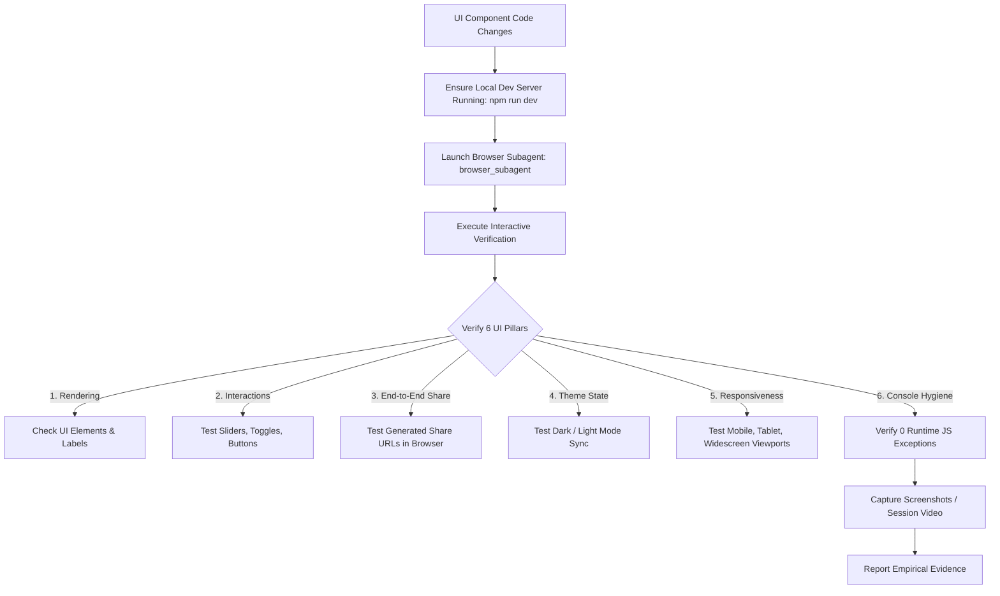

# Autonomous Browser UI & Component Testing Skill

## Overview

This skill enforces automated, interactive, and visual UI verification for web applications. Never mark a UI feature or bug fix as complete based solely on code compilation. You MUST execute real browser interactions and gather visual evidence before completion.

---

## 🛠️ Verification Workflow

---

## 📋 The 6 UI & Functional Verification Pillars

### 1. Visual Rendering & Accessibility
- Verify all headers, labels, KPI cards, input sliders, and action buttons render with high visual contrast.
- Ensure text is clear, formatted properly, and contains no placeholder `NaN`, `null`, `undefined`, or broken layout overflow.

### 2. Interactive Input & State Synchronization
- Interact with sliders, numerical inputs, select dropdowns, and preset buttons.
- Confirm that slider movements instantly trigger state updates, recalculations, and graph chart animations.

### 3. End-to-End Share Link & Deep Linking Verification
- Open the Share Modal, copy the generated URL link (e.g., `http://localhost:5173/?util=01-ltv-calculator&state=...`).
- Instruct the browser subagent to **navigate directly to the generated URL**.
- Confirm that:
  - The browser opens the correct utility view automatically.
  - The inputs match the shared values exactly (not default fallbacks).
  - The Toast notification confirms "Loaded shared calculator state from URL link!".

### 4. Dark / Light Theme System
- Trigger the theme toggle button in the header bar (`Header.tsx`).
- Verify smooth transition between Dark mode (`bg-slate-950`) and Light mode (`bg-slate-50`).
- Ensure glassmorphic panel contrast and text legibility remain vibrant in both modes.

### 5. Multi-Device Responsive Layouts
- Test across standard viewport breakpoints:
  - **Mobile Portrait:** 375px × 667px (Single-column layout, touch target sizing).
  - **Tablet:** 768px × 1024px (2-column layout, navigation collapse).
  - **Widescreen Desktop:** 1440px × 900px (Full multi-column layout with fixed sidebars).

### 6. Console & Network Hygiene
- Open browser devtools console and inspect for errors.
- Confirm zero unhandled JavaScript exceptions, React key warnings, or missing resource 404s.

---

## 🤖 Using Subagents for Automated UI Testing

When implementing any UI component, page view, or styling change:

1. **Dispatch a Browser Subagent (`browser_subagent`):**
   - Provide a clear, detailed prompt describing the URL (`http://localhost:5173`), the specific component under test, target inputs to manipulate, and exact visual/functional criteria to check.
2. **Recording & Evidence:**
   - Name the recording descriptive (e.g. `RecordingName: "share_url_deep_link_test"`).
   - Capture screenshots of key interactive states.
3. **Synthesis:**
   - Read the subagent report, verify screenshots/videos, and address any UI defects before marking work complete.
