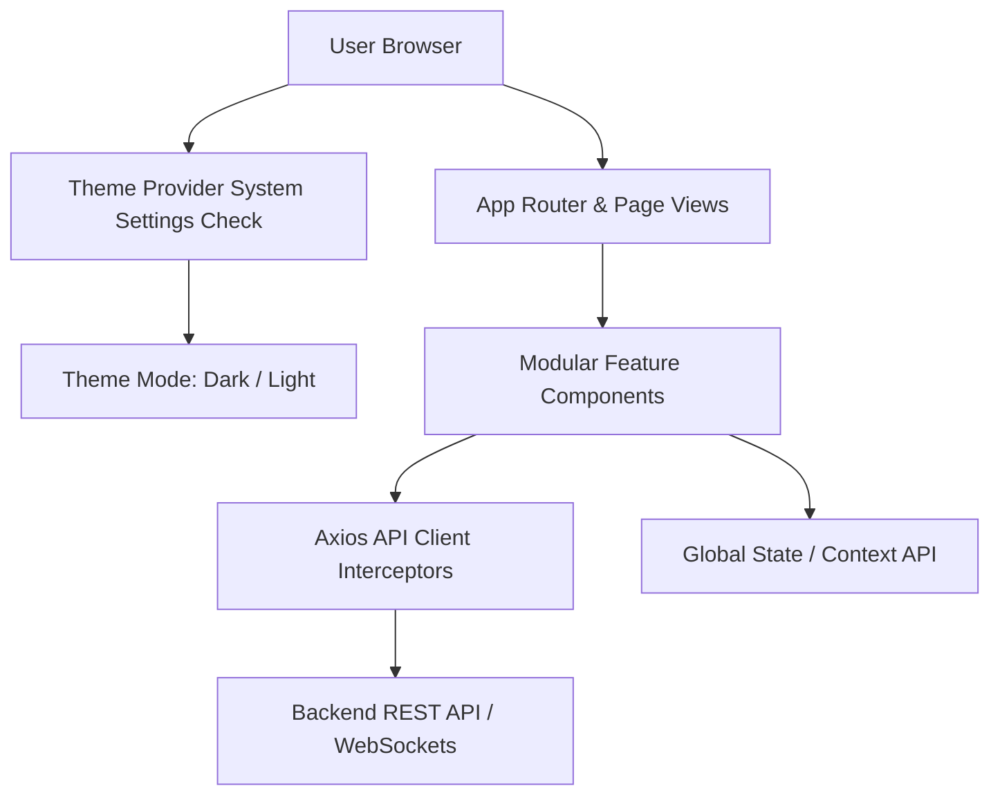

# 🎨 Production-Grade Frontend Architecture Skill

This skill defines the canonical standards, architectural principles, and component design patterns for building state-of-the-art React frontend applications (Vite, TypeScript, Tailwind CSS).

---

## 🌟 Core Architectural Pillars



### 1. Vite + React + TypeScript Foundation
- High-performance SPA build setup using **Vite**, **TypeScript** (strict mode), and **Tailwind CSS**.
- Production build requirement: `npm run build` (`tsc && vite build`) MUST pass cleanly with 0 compilation or type errors.

### 2. Dark & Light Mode Theme Strategy (System Config Auto-Detection)
- **Automatic System Preference Reading**:
  - The application MUST inspect system-level theme preferences using `window.matchMedia('(prefers-color-scheme: dark)')`.
  - Automatically applies **Dark Mode** or **Light Mode** based on system OS configuration.
- **Default to Dark Mode Fallback**:
  - If system theme configuration cannot be read, is unsupported, or is not explicitly set, the application MUST **default to Dark Mode**.
- **User Preference Override & Persistence**:
  - Provides a global `ThemeProvider` & `ThemeContext` exposing `theme` (`'dark' | 'light'`) and `setTheme()`.
  - Persists manual theme toggles in `localStorage` (`joygpt_theme`), overriding system defaults when manually selected by the user.

```typescript
// Canonical Theme Provider Pattern (React + TypeScript)
export type Theme = 'dark' | 'light';

export const getInitialTheme = (): Theme => {
  const savedTheme = localStorage.getItem('app_theme') as Theme;
  if (savedTheme === 'dark' || savedTheme === 'light') {
    return savedTheme;
  }
  if (window.matchMedia && window.matchMedia('(prefers-color-scheme: light)').matches) {
    return 'light';
  }
  // Default to Dark mode if system config cannot be read or is not set
  return 'dark';
};
```

### 3. Rich Aesthetics & Modern Design System
- **Curated Color Palettes**: Sleek dark mode gradients (`#090d16`, `#0f172a`), HSL tailored accent colors, glassmorphic panels (`backdrop-blur-md bg-slate-900/80 border border-slate-800`).
- **Typography & Icons**: Modern typography (Google Fonts *Inter* / *Outfit*) with `lucide-react` icons.
- **Interactive Micro-Animations**: Smooth hover states, glowing action buttons, pulsing loading indicators, and slide-in drawers.
- **No Static Placeholders**: All data visualizations must use real or dynamically simulated chart engines (e.g. Recharts Line, Bar, Pie, KPI cards).

### 4. Modular Directory & Component Layout
```text
src/
├── api/                # Axios instance, request/response interceptors & error handlers
├── assets/             # SVGs, images, static media
├── components/         # Reusable UI primitives (buttons, modals, inputs, charts, cards)
│   ├── common/         # ThemeToggle, Modal, Toast, LoadingSpinner
│   └── layout/         # Navbar, Sidebar, PageContainer
├── context/            # AuthContext, ThemeContext, OrgContext
├── hooks/              # Custom React hooks (useTheme, useFetch, useMediaQuery)
├── pages/              # Route views (DashboardPage, WorkbenchPage, SettingsPage)
├── types/              # TypeScript interfaces, DTO models, API response types
└── App.tsx
```

### 5. Axios API Client Interceptors
- Centralized Axios client (`src/api/client.ts`) with request interceptors for attaching JWT `Authorization: Bearer <token>` and `x-org-id` headers.
- Response interceptors for global HTTP error handling (HTTP 401 token refresh/logout redirect, HTTP 403 access lockout screens, HTTP 500 toast notifications).

### 6. Zero Dependency Vulnerabilities Compliance
- All package dependencies in `package.json` must be strictly audited and maintained at **0 vulnerabilities** (`npm audit` must return 0 vulnerabilities).
- Require explicit version overrides in `package.json` for transitive dependencies if security advisories are flagged.
- Running `npm install` or `npm audit` on the frontend codebase MUST result in **`0 vulnerabilities`** at all times.

### 7. Mandatory Meaningful README.md Documentation
- Every frontend application repository MUST include a comprehensive, meaningful `README.md` at its root directory.
- The README.md must clearly document:
  - Application overview, key feature modules, and user workflows.
  - UI design tokens, aesthetics, and component layout architecture.
  - Dark/Light Theme Provider setup and OS system config auto-detection logic.
  - Environment variable setup (`.env.example` reference).
  - Local development scripts (`npm run dev`, `npm run build`, `npm run preview`).
  - Production build bundle optimization and Nginx container deployment instructions.

---

## 📋 Implementation Checklist for Subagents

- [ ] Verify `npm run build` compiles cleanly with 0 TypeScript/Vite errors.
- [ ] Verify `npm audit` returns **0 vulnerabilities**.
- [ ] Implement `ThemeProvider` inspecting `window.matchMedia` defaulting to Dark mode.
- [ ] Ensure `README.md` is complete and accurately documents application architecture and run commands.
- [ ] Ensure all interactive buttons, modals, and input fields feature distinct IDs and accessibility labels.
