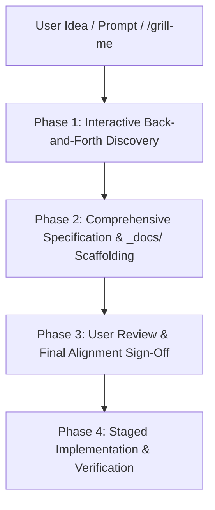

# 💡 Idea-to-Product Discovery & Execution Skill

This skill governs how Antigravity handles new product ideas, feature proposals, and initial application concepts. It enforces an interactive back-and-forth discovery process, feature brainstorming, architectural critique, complete schema documentation, and explicit user sign-off **BEFORE** any source code implementation begins.

---

## 🏛️ Core Principles

1. **No Rushing to Code**: Never write source code or scaffold implementation code immediately after an initial prompt or high-level grill-me session.
2. **Proactive Feature Brainstorming**: Do not just collect user preferences. Actively suggest complementary features, critique proposed features, point out edge cases, and present trade-offs.
3. **Documentation-First Blueprinting**: Before starting code execution, create comprehensive canonical documentation inside `_docs/`, including complete ERDs, database table schemas (all columns, types, FKs, indexes), and step-by-step working mechanisms.
4. **Explicit Sign-Off Gate**: Require explicit user approval on the feature set and documentation before writing any codebase files.

---

## 🔄 4-Phase Discovery & Execution Workflow

---

### Phase 1: Interactive Back-and-Forth Discovery & Critique

When presented with a product idea:
1. **Interactive Interview & Grill-Me**:
   - Ask clarifying questions one topic at a time using `ask_question`.
   - Walk down each branch of the product tree (Target Audience, Core Features, Tech Stack, Database Strategy, RBAC/Auth, Security & Monetization).
2. **Mandatory Onboarding & Access Control Checklist**:
   - **Onboarding Model**: Explicitly ask whether the SaaS is *Self-Serve* (any signup auto-creates a workspace) vs *Strict Invitation-Only* (System Owner -> Admin Invite -> Team Invite).
   - **System Owner Whitelist**: Explicitly identify who the System/SaaS Owners are and how they are configured (e.g. `.env` system owner whitelist `SYSTEM_OWNER_EMAILS`).
   - **Uninvited User Login Behavior**: Explicitly define what happens when an unrecognized/uninvited user signs in (e.g. return explicit `HTTP 401: Access Pending / Invitation Required` error).
3. **Feature Brainstorming & Critique**:
   - **Suggest Features**: Propose high-value features the user might not have thought of (e.g. audit logs, query caching, Slack/Discord alerts, CSV exports, webhook triggers).
   - **Question/Critique Features**: Challenge ambiguous or risky requirements (e.g. *"Direct execution on production DB vs read-only replicas"*, *"Self-hosted LLM vs Cloud API"*).
   - **Explore Edge Cases**: Address rate limits, multi-tenancy data leaks, large dataset pagination, timeout handling, and failure fallbacks.

---

### Phase 2: Comprehensive Specification & `_docs/` Scaffolding

Once features and architecture are aligned, scaffold complete canonical documentation under `_docs/`:

1. **`_docs/project-overview.md`**:
   - Executive summary, vision, full feature list, tech stack rationale, and repository structure.
2. **`_docs/architecture/database-schema.md`**:
   - Complete Database Schema & Entity Relationship Diagram (ERD).
   - Detailed table-by-table specifications listing **all column names, data types, nullability, default values, primary keys, foreign keys, and indexes**.
3. **`_docs/architecture/working-mechanisms.md`**:
   - Deep-dive technical explanations for every core workflow:
     - Authentication & Session Lifecycle
     - Schema Introspection & Context Formatting
     - AI Text-to-SQL Prompting & AST Safety Parsing
     - Safe Query Execution & Latency Profiling
     - Dynamic Chart Visualization Pipeline
     - PDF Report Compilation & BullMQ Email Dispatch
4. **`_docs/DECISIONS.md`**:
   - Architectural decisions log recording chosen patterns, DB ORM choices, AI provider trade-offs, and security controls.
5. **`_docs/TODO.md`**:
   - Complete itemized feature backlog with priorities.

---

### Phase 3: User Review & Final Alignment Sign-Off

1. Present the complete feature set and link to the generated documentation files in `_docs/`.
2. Highlight key open questions or decisions requiring user confirmation.
3. **STOP** and wait for explicit user approval before proceeding to implementation.

---

### Phase 4: Staged Implementation & Empirical Verification

1. Once approved, implement the application in logical, verified stages (Database & Infrastructure -> Backend API -> Frontend UI -> Integration Tests).
2. Run build (`npm run build`), test, and lint commands after every stage to guarantee zero TypeScript or runtime errors.
3. Update `_docs/current-status.md` and `_docs/TODO.md` dynamically as tasks complete.
