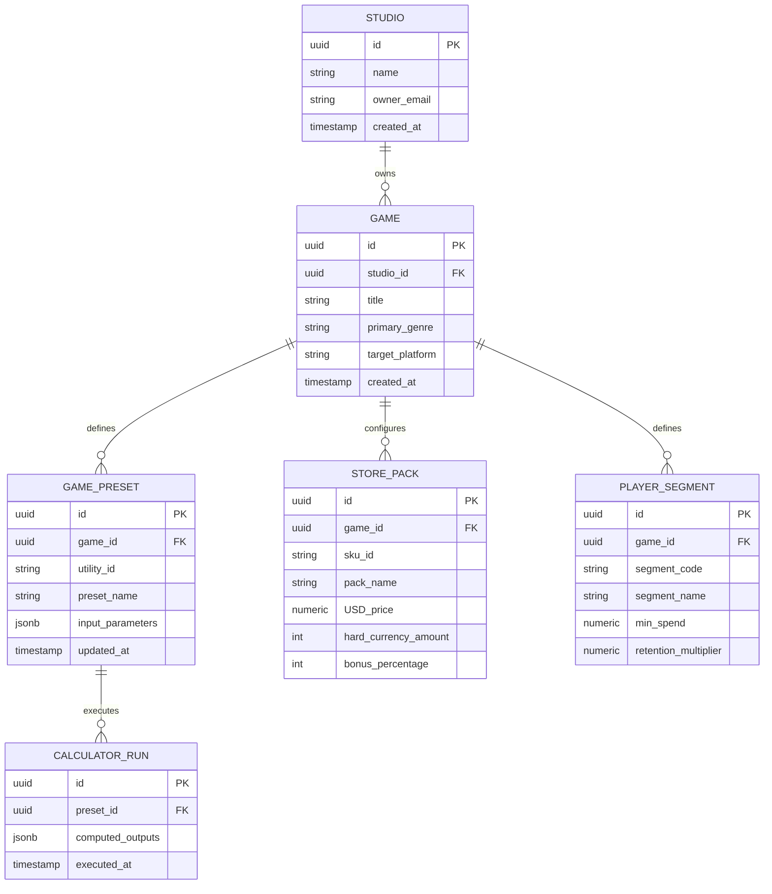

# 📐 Data Models & Schema Architecture — GameTuneKit

This document defines the data structures, local state schemas, and future relational database tables for GameTuneKit.

---

## 1. Client-Side Data Models (Layer 0 Standalone State)

In Layer 0, all calculations execute entirely in client memory. Presets and user session state are serialized to `localStorage` or URL search parameters.

```typescript
// Shared Types & Presets Model

export type UtilityFamily = 
  | 'pricing-monetisation'
  | 'growth-ua'
  | 'intelligence-metrics'
  | 'economy-simulation'
  | 'liveops'
  | 'data-experimentation';

export interface UtilityMeta {
  id: string; // e.g. "ltv-calculator"
  code: string; // e.g. "01"
  name: string;
  family: UtilityFamily;
  description: string;
  layer: 'L0' | 'L1' | 'L2' | 'L3' | 'L4';
  isCore: boolean;
}

// Local Preset Storage Schema (localStorage key: "gametune_presets_v1")
export interface UserSavedPreset {
  id: string;
  utilityId: string;
  name: string;
  createdAt: string;
  inputs: Record<string, number | string | boolean | Array<unknown>>;
}
```

---

## 2. Future Relational Database Schema (Layer 1+ Game-Aware Storage)

When transitioning to Layer 1 (Game-Aware Studio Workspace), the following relational PostgreSQL schema will be used:



---

## 3. Table Specifications (PostgreSQL DDL Reference)

### `studios` Table
- `id` (UUID, Primary Key, Default: `gen_random_uuid()`)
- `name` (VARCHAR(255), NOT NULL)
- `owner_email` (VARCHAR(255), NOT NULL, UNIQUE)
- `created_at` (TIMESTAMPTZ, Default: `NOW()`)

### `games` Table
- `id` (UUID, Primary Key)
- `studio_id` (UUID, Foreign Key -> `studios.id` ON DELETE CASCADE)
- `title` (VARCHAR(255), NOT NULL)
- `primary_genre` (VARCHAR(100), NOT NULL)
- `target_platform` (VARCHAR(50), Default: `'mobile'`)
- `created_at` (TIMESTAMPTZ, Default: `NOW()`)
- **Index:** `idx_games_studio_id` (`studio_id`)

### `game_presets` Table
- `id` (UUID, Primary Key)
- `game_id` (UUID, Foreign Key -> `games.id` ON DELETE CASCADE)
- `utility_id` (VARCHAR(100), NOT NULL) -- e.g. 'ltv-calculator'
- `preset_name` (VARCHAR(255), NOT NULL)
- `input_parameters` (JSONB, NOT NULL)
- `updated_at` (TIMESTAMPTZ, Default: `NOW()`)
- **Index:** `idx_game_presets_utility` (`game_id`, `utility_id`)
