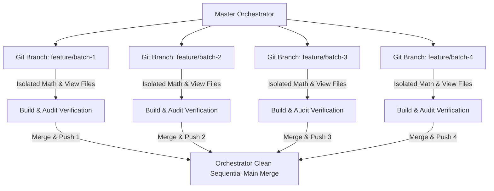

# Implementation Plan — Conflict Isolation & Git Branching Protocol

This document details the exact technical mechanisms used to guarantee that parallel subagents operate with **zero file conflicts, zero side-effects, and zero broken commits**.

---

## 🛡️ 3-Tier Conflict Prevention Architecture

---

## 1. File-Level Module Isolation (Zero Code Overlap)

Every utility is created as a completely self-contained, isolated module:
- **Math Engine:** `frontend/src/engine/<utilityName>Calculator.ts` (100% unique per utility).
- **View Component:** `frontend/src/components/utilities/<UtilityName>CalculatorView.tsx` (100% unique per utility).
- **Result:** No subagent edits or overwrites another utility's engine or component file.

---

## 2. Git Branch Isolation Strategy (Branch-per-Batch)

To prevent simultaneous git write conflicts, each subagent operates on its own dedicated feature branch:

| Subagent / Batch | Dedicated Git Branch Name | Target Utility Scope |
|---|---|---|
| **Subagent 1** | `feature/batch-1-growth-monetisation` | UTIL-003, 005, 004, 007, 008, 009, 010, 012 |
| **Subagent 2** | `feature/batch-2-economy-systems` | UTIL-013, 015, 016, 017, 018, 020, 021, 023 |
| **Subagent 3** | `feature/batch-3-liveops-analytics` | UTIL-033, 034, 035, 011, 022, 026 |
| **Subagent 4** | `feature/batch-4-attribution-benchmarks` | UTIL-030, 031, 024, 025, 029, 028, 006, 019 |

---

## 3. Orchestrator Merge & Verification Pipeline

Once a subagent completes its branch:
1. **Branch Build Check:** Runs `npm run build` and `npm audit` on the feature branch.
2. **Sequential Main Merge:** The Orchestrator merges the feature branch into `main` using `git merge --no-ff`.
3. **Main Re-verification:** Re-runs `npm run build` on `main` to guarantee zero integration regressions.
4. **Push to Remote:** Pushes the verified merge commit to GitHub (`fahadmp955/game-tune-kit`).
